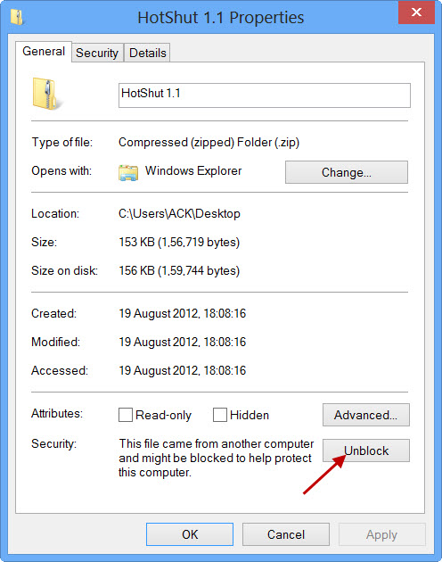

# Access Management System
A system build to experiment with a multi-level asynchronous approval system. Where a user would request approval for certain permissions and it would trigger a multi-level approval process, where one level of approval requests approval for the next layer.

# CakePHP Application Skeleton

[](https://travis-ci.org/cakephp/app)
[](https://packagist.org/packages/cakephp/app)
[](https://github.com/phpstan/phpstan)

A skeleton for creating applications with [CakePHP](https://cakephp.org) 4.x.

The framework source code can be found here: [cakephp/cakephp](https://github.com/cakephp/cakephp).

## Installation

Full installation guidelines can be found [here](https://book.cakephp.org/4/en/installation.html).

To install CakePHP it is best to download [XAMPP](https://www.apachefriends.org/download.html). This will come with all PHP extensions and PHP itself, as required.

You will need to edit the php.ini file within XAMPP's installation location. Your typical location for this will be C:\xampp\php\php.ini 

When the file is located you'll need to open it and scroll down to a block of "extension=" assignments. You will see 

```php
;extension=intl
```

Commented out, simply uncomment this line to enable it.

```php
extension=intl
```

After this, launch XAMPP and start up a SQL server and Apache server. This will give you access to a DBMS called PhpMyAdmin, which can be used to develop the application in tandem with a SQL database.

Next composer must be installed from [here](https://getcomposer.org/download/). You may enounter an issue of Windows SmartScreen blocking the installer from running. You remedy this by opening in the properties and clicking "Unblock".



After composer is installed you may create CakePHP projects by: 

If Composer is installed globally, run

```bash
composer create-project --prefer-dist cakephp/app
```

In case you want to use a custom app dir name (e.g. `/myapp/`):

```bash
composer create-project --prefer-dist cakephp/app myapp
```

You can now either use your machine's webserver to view the default home page, or start
up the built-in webserver with:

```bash
bin/cake server -p 8765
```

If you want to run this project, you only need to run the above command in the projects root.

Then visit `http://localhost:8765` to see the welcome page.

## Configuration

Read and edit the environment specific `config/app_local.php` and setup the 
`'Datasources'` and any other configuration relevant for your application.
Other environment agnostic settings can be changed in `config/app.php`.

Note: Go to "User Accounts" tab in PHPMyAdmin to find users to connect to the database as.

## Plugins

This project uses CakePHP 4.0 which is a fairly recent release. This means that a lot of prior plugins for CakePHP 3.x may not work. A good place to find a list of support plugins is the [Awesome CakePHP Plugin list](https://github.com/FriendsOfCake/awesome-cakephp#queue)

## Layout

The app skeleton uses [Milligram](https://milligram.io/) (v1.3) minimalist CSS
framework by default. You can, however, replace it with any other library or
custom styles.
